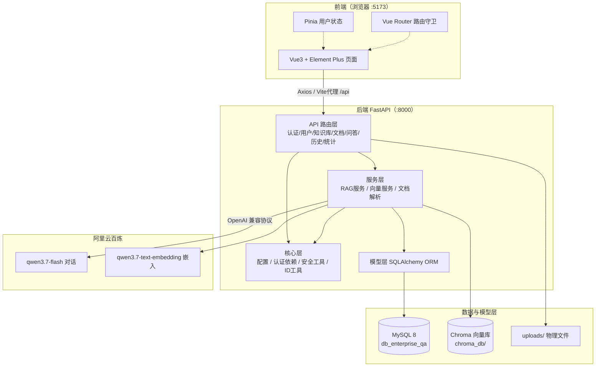
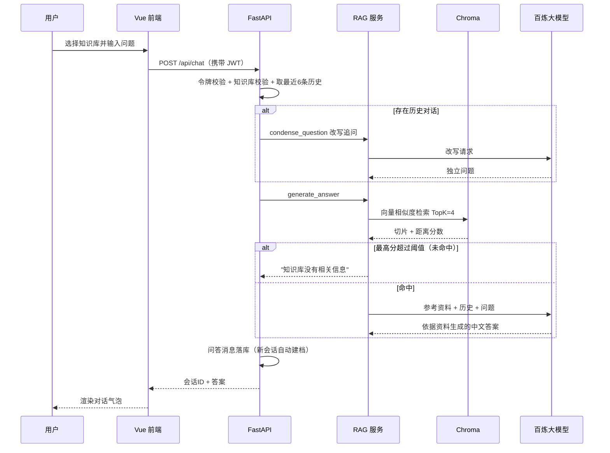
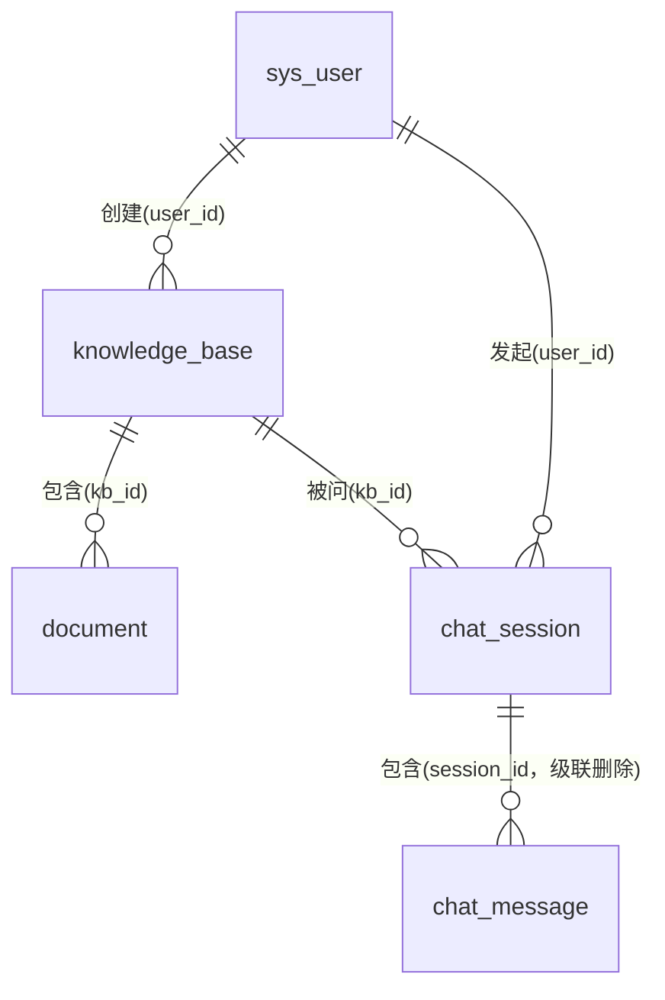

# 企业知识库问答系统 · 整体介绍

> 基于 **LangChain + RAG（检索增强生成）** 的企业内部知识库智能问答系统
> 版本：V1.0.0　|　文档更新日期：2026-09-21

---

## 目录

1. [项目整体描述](#一项目整体描述)
2. [技术栈概述](#二技术栈概述)
3. [系统整体架构](#三系统整体架构)
4. [后端技术架构](#四后端技术架构)
5. [前端技术实现](#五前端技术实现)
6. [系统核心特点](#六系统核心特点)
7. [部署、安全与扩展性](#七部署安全与扩展性)
8. [附录：目录结构与启动方式](#八附录目录结构与启动方式)

---

## 一、项目整体描述

### 1.1 系统定位

企业知识库问答系统是一套面向企业内部的**智能知识管理与自然语言问答平台**。系统以 RAG（Retrieval-Augmented Generation，检索增强生成）为核心技术路线，将企业散落在各类制度文档、产品手册、技术规范中的非结构化知识统一纳管，并通过大语言模型（LLM）以"对话"的方式向员工提供精准、可溯源的答案。

系统要解决的核心痛点是：**企业知识"找不到、读不完、问不准"**——文档分散、版本混乱，员工面对问题时往往需要在多个文件中人工检索，而直接使用通用大模型又存在"不了解企业内部情况、容易编造答案"的问题。

### 1.2 核心功能

| 功能域     | 功能说明                                                                                        |
| ---------- | ----------------------------------------------------------------------------------------------- |
| 登录认证   | 用户名 + 密码登录，JWT 令牌鉴权，支持登录态保持与失效自动跳转                                   |
| 数据概览   | 用户总数、知识库数量、文档总数、今日提问数 4 项核心指标；近 7 天提问趋势图、知识库文档占比图    |
| 知识库管理 | 知识库的新建、编辑、删除；每个知识库与一个 Chroma 向量集合一一对应                              |
| 文档管理   | 上传 txt / md / pdf / docx 文档，自动完成解析、切片、向量化；支持删除（同步清除向量与物理文件） |
| 智能问答   | 选择知识库后用自然语言提问，系统检索相关知识并生成答案，支持多轮追问                            |
| 对话历史   | 按用户隔离的会话列表、会话详情回溯、会话删除                                                    |
| 用户管理   | 管理员新建 / 编辑 / 删除用户、分配角色与启停状态                                                |
| 用户主页   | 员工自助维护个人信息、修改登录密码                                                              |

### 1.3 设计目标

- **答案可信**：严格约束模型"只依据企业资料回答"，无依据时明确告知，杜绝幻觉；
- **知识可管**：知识库与文档全生命周期线上化管理，新增知识即时可问；
- **权限可控**：管理员与普通用户两级角色，功能菜单、接口、数据三层隔离；
- **架构清晰**：前后端分离 + 后端分层，结构简单易懂，便于学习、维护与扩展；
- **低成本落地**：采用开源组件 + 国产大模型 API，无需 GPU 集群即可部署运行。

### 1.4 应用场景与目标用户

**应用场景：**

- 人力资源：考勤休假、招聘入职、薪酬福利、培训晋升等制度咨询；
- 财务管理：差旅报销、采购付款、固定资产、费用标准等规则查询；
- 产品研发：产品说明书、技术架构、接口规范、数据安全制度等知识检索；
- 可延伸至行政合规、客服话术、法务合同、IT 运维手册等任意文档型知识场景。

**目标用户：**

| 用户角色            | 典型诉求                                                |
| ------------------- | ------------------------------------------------------- |
| 系统管理员（admin） | 建设与维护知识库、管理文档与用户、掌握整体使用情况      |
| 普通员工（user）    | 用自然语言快速获得制度/业务问题的准确答案，回溯历史问答 |

### 1.5 价值定位

系统在企业知识管理与信息检索中的价值体现为三个转变：

1. **从"人找文档"到"答案找人"**：员工提问即得答案，无需阅读整份文件；
2. **从"通用 AI 答非所问"到"企业专属 AI 有据可依"**：RAG 将大模型能力锚定在企业真实资料上；
3. **从"知识沉淀靠个人"到"组织知识资产化"**：文档统一入库、统一更新、统一服务，知识随企业持续积累。

---

## 二、技术栈概述

### 2.1 技术栈总览

| 层次         | 技术选型                          | 版本           | 用途                                     |
| ------------ | --------------------------------- | -------------- | ---------------------------------------- |
| 后端语言     | Python                            | 3.13           | 后端开发语言                             |
| Web 框架     | FastAPI                           | 0.141.1        | HTTP API 框架，自带 OpenAPI 文档         |
| ASGI 服务器  | Uvicorn                           | 0.53.0         | 后端服务运行容器                         |
| ORM 框架     | SQLAlchemy                        | 2.0.54         | 关系数据库对象关系映射                   |
| MySQL 驱动   | PyMySQL + cryptography            | 1.2.3 / 50.0.1 | 连接 MySQL，支持 caching_sha2_password   |
| 关系数据库   | MySQL                             | 8.x            | 存储用户、知识库、文档、问答记录         |
| 向量数据库   | ChromaDB                          | 1.5.9          | 持久化文档向量切片，支持相似度检索       |
| LLM 应用框架 | LangChain 全家桶                  | 1.4.x          | 提示词编排、文本切片、向量库集成（LCEL） |
| 对话大模型   | 阿里云百炼 qwen3.7-flash          | —             | 问题改写与答案生成                       |
| 嵌入模型     | 阿里云百炼 qwen3.7-text-embedding | —             | 文本向量化                               |
| 前端框架     | Vue                               | 3.5.x          | 组合式 API 单页应用                      |
| 构建工具     | Vite                              | 8.3.x          | 前端开发服务器与打包构建                 |
| 路由         | Vue Router                        | 5.x            | SPA 路由与导航守卫                       |
| 状态管理     | Pinia                             | 4.x            | 用户登录态全局管理                       |
| UI 组件库    | Element Plus                      | 2.14.x         | 企业级桌面端组件                         |
| 图表库       | ECharts + vue-echarts             | 6.x            | 趋势图、占比图                           |
| HTTP 客户端  | Axios                             | 1.20.x         | 接口调用，统一拦截                       |
| 认证方案     | PyJWT                             | 2.14.0         | JWT 令牌签发与校验                       |
| 文档解析     | pypdf / python-docx               | 6.19 / 1.2     | PDF、DOCX 文本提取                       |
| 样式预处理   | sass-embedded                     | 1.104          | SCSS 样式支持                            |

### 2.2 关键工具说明

- **LangChain**：承担 RAG 链路编排，使用 LCEL（LangChain Expression Language）以"提示词 | 模型"的管道式写法组装链；
- **Chroma**：轻量级开源向量数据库，以本地目录持久化，一个知识库对应一个 collection；
- **阿里云百炼**：通过 OpenAI 兼容接口接入，对话与嵌入均走云端 API，本地无需模型算力；
- **FastAPI**：自动生成 Swagger UI（`/docs`），接口参数校验由 Pydantic 完成。

---

## 三、系统整体架构

### 3.1 架构形态

系统采用 **前后端分离 + 后端单体分层架构**。后端为单个 FastAPI 应用，内部分层清晰（路由层 / 服务层 / 模型层 / 核心层），在中小规模知识问答场景下具备部署简单、调试方便、易于理解的优势；分层与模块化设计也为未来向微服务拆分保留了边界。

### 3.2 总体架构图



### 3.3 一次问答的完整流转



---

## 四、后端技术架构

### 4.1 分层设计

后端代码位于 `server/`，遵循经典四层划分：

```
server/app/
├── api/        路由层：HTTP 入口、参数接收、权限依赖、响应模型
├── services/   服务层：RAG 问答、向量库操作、文档解析（核心业务逻辑）
├── models/     模型层：SQLAlchemy ORM 实体
├── schemas/    Schema 层：Pydantic 请求/响应模型（参数校验与序列化）
├── core/       核心层：配置管理、认证依赖、JWT/MD5 工具、ID 分配工具
└── db/         数据库：引擎、会话工厂、声明式 Base
```

**调用约定**：路由层只做编排，不写复杂业务；业务逻辑下沉到服务层；所有数据访问通过 ORM 模型完成；跨层共享配置统一取自 `core/config.py` 的全局 `settings` 单例，杜绝硬编码。

### 4.2 核心模块划分

| 模块         | 文件                                                    | 职责                                                                |
| ------------ | ------------------------------------------------------- | ------------------------------------------------------------------- |
| 应用入口     | `main.py`                                             | 创建应用、CORS、注册路由、全局异常处理、健康检查                    |
| 认证模块     | `api/auth.py`、`core/security.py`、`core/deps.py` | 登录签发 JWT、令牌解析、当前用户依赖、管理员依赖                    |
| 用户管理模块 | `api/users.py`                                        | 用户 CRUD、个人信息修改、密码修改（个人路由前置避免动态路由误匹配） |
| 知识库模块   | `api/knowledge.py`                                    | 知识库 CRUD，同步创建/删除 Chroma collection                        |
| 文档管理模块 | `api/documents.py`                                    | 文档上传、列表、删除，编排"存文件→解析→切片→向量化"全流程        |
| 问答处理模块 | `api/chat.py`、`services/rag_service.py`            | 会话管理、历史装配、问题改写、检索生成                              |
| 向量服务模块 | `services/vector_service.py`                          | 嵌入模型单例、collection 管理、切片增删、带分检索                   |
| 文档解析模块 | `services/document_parser.py`                         | 按后缀分发解析 txt/md/pdf/docx                                      |
| 历史模块     | `api/history.py`                                      | 用户私有会话列表、详情、删除                                        |
| 统计模块     | `api/stats.py`                                        | 4 指标 + 7 天趋势 + 知识库文档占比                                  |

### 4.3 API 设计规范

- **风格**：RESTful 风格，资源式路径；统一业务前缀 `/api`；
- **前缀分组**：按模块划分前缀，便于识别与鉴权：

| 路由前缀           | 模块     | 主要接口                                                                              |
| ------------------ | -------- | ------------------------------------------------------------------------------------- |
| `/api/auth`      | 认证     | `POST /login`、`GET /me`                                                          |
| `/api/users`     | 用户管理 | `GET`、`POST`、`PUT/{id}`、`DELETE/{id}`、`PUT /profile`、`PUT /password` |
| `/api/knowledge` | 知识库   | `GET`、`POST`、`PUT/{id}`、`DELETE/{id}`                                      |
| `/api/documents` | 文档     | `GET`、`POST /upload`、`DELETE/{id}`                                            |
| `/api/chat`      | 智能问答 | `POST`                                                                              |
| `/api/history`   | 对话历史 | `GET /sessions`、`GET /sessions/{id}`、`DELETE /sessions/{id}`                  |
| `/api/stats`     | 数据概览 | `GET /overview`                                                                     |

- **响应规范**：成功响应由 Pydantic response_model 序列化；参数校验失败统一返回 `422 + {code, message, detail}`；未捕获异常统一兜底为 `500`，不向前端暴露堆栈；
- **接口文档**：FastAPI 自动生成 OpenAPI 3.1 描述，开发期可访问 `/docs`（Swagger UI）；
- **鉴权方式**：`Authorization: Bearer <JWT>`，通过 FastAPI 依赖注入实现；
- **文件上传**：`multipart/form-data`，文件以 UUID 重命名落盘，规避中文与重名问题。

### 4.4 数据模型设计

数据库 `db_enterprise_qa` 共 5 张表，字符集统一 utf8mb4：

| 表名               | 说明     | 关键字段                                                                                                           |
| ------------------ | -------- | ------------------------------------------------------------------------------------------------------------------ |
| `sys_user`       | 系统用户 | id、username(唯一)、password(MD5)、role(admin/user)、status(1/0)、created_at、updated_at                           |
| `knowledge_base` | 知识库   | id、name(唯一)、collection_name(唯一)、user_id、doc_count                                                          |
| `document`       | 文档     | id、kb_id、file_name、file_path、file_type、file_size、chunk_count、status(processing/completed/failed)、error_msg |
| `chat_session`   | 问答会话 | id、user_id、kb_id、title（首问前 20 字）                                                                          |
| `chat_message`   | 对话消息 | id、session_id、role(user/assistant)、content                                                                      |

表间关系：



> 说明：数据库表未强制物理外键，关联以逻辑关联为主（仅 ORM 层声明 ForeignKey 与 relationship），因此部署与数据维护较为灵活。

### 4.5 RAG 数据处理流程

#### （1）知识入库流程（离线/上传时）

1. **保存文件**：校验后缀（`.txt/.md/.pdf/.docx`）与知识库存在性，UUID 重命名写入 `uploads/`；
2. **创建记录**：文档以 `processing` 状态入库；
3. **解析文本**：按后缀分发——txt/md 直接读取（UTF-8，错误忽略），pdf 用 pypdf 逐页提取，docx 用 python-docx 提取非空段落；
4. **递归切片**：`RecursiveCharacterTextSplitter`，默认 **chunk_size=500、chunk_overlap=50**，按段落/换行/句号逐级切分；
5. **向量化写入**：每个切片附带 `{doc_id, kb_id, file_name}` 元数据，经嵌入模型向量化后写入对应 Chroma collection；
6. **状态回写**：成功置 `completed` 并记录切片数、知识库文档数 +1；异常置 `failed` 并记录错误原因。

#### （2）问答生成流程（在线）

1. **多轮改写**：携带历史时，先用 `CONDENSE_PROMPT` 把"需要提前多久申请？"这类追问改写为"远程办公需要提前多久申请？"式独立问题，保证检索语义完整；改写失败自动回退原始问题；
2. **向量检索**：`similarity_search_with_score` 取 **TopK=4** 切片及平方欧氏距离分数；
3. **阈值判定**：仅保留分数 **≤ 1.0** 的切片；全部超阈值则直接返回"知识库没有相关信息"，不再调用生成模型；
4. **上下文拼装**：命 中切片编号为 `[资料1]…[资料N]` 拼接；
5. **受控生成**：系统提示词强制"只能使用参考资料、无相关内容直接告知、中文且言简意赅"，以 **temperature=0.1** 调用 qwen3.7-flash；
6. **消息落库**：用户提问与 AI 回答成对写入，新会话自动建档（标题取首问前 20 字）。

核心提示词如下：

```python
SYSTEM_PROMPT = """你是企业内部知识库问答助手，请严格依据【参考资料】回答用户问题。
回答要求：
1. 只能使用参考资料中的信息，不得凭空编造；
2. 如果参考资料中没有与问题相关的内容，请直接回复"知识库没有相关信息"；
3. 使用中文回答，条理清晰、言简意赅。

【参考资料】
{context}"""
```

### 4.6 关键技术实现说明

- **嵌入模型单例**：`vector_service.get_embeddings()` 全局只初始化一次，并关闭 tiktoken 长度校验以兼容非 OpenAI 模型名；
- **Chroma 持久化**：`PersistentClient` 指向 `chroma_db/` 目录，服务重启后向量不丢失；删除文档按元数据 `doc_id` 精确清除切片；
- **连接池健壮性**：SQLAlchemy 引擎开启 `pool_pre_ping`（取连接前探活）与 `pool_recycle=3600`（防止 MySQL 断开空闲连接）；
- **ID 自动填补**：新建用户/知识库/文档时，通过 `next_available_id` 扫描现有 ID 并返回最小可用值，删除记录后再新建可自动填补空缺，保证 ID 连续唯一；
- **级联删除**：删除会话 ORM 层 `cascade="all, delete-orphan"` 自动清除消息；删除知识库同步 drop 向量集合。

> 关于"知识图谱"的说明：本系统当前版本**未引入知识图谱**，知识组织以"文档切片 + 向量语义检索"为主，构建成本低且对非结构化文档适应性强。实体关系知识图谱可作为后续演进方向（见第七章扩展设计）。

---

## 五、前端技术实现

### 5.1 设计理念

- **企业级中后台风格**：左侧深色导航 + 顶部信息栏 + 右侧内容区的经典布局，学习成本低；
- **角色自适应**：菜单与路由均按角色动态渲染/拦截，管理员与员工看到不同的工作台；
- **即时反馈**：操作结果以消息条（Message）提示，长耗时任务状态明确，防重复提交。

### 5.2 整体布局

主布局 `layout/MainLayout.vue` 基于 Element Plus 的 `el-container`：

- **侧边栏（220px）**：系统标识 + `el-menu` 导航，菜单由路由表根据角色过滤生成；
- **顶部栏**：当前模块名称 + 右上角用户头像/姓名/角色标签，下拉采用 `trigger="click"`（兼顾触屏）提供"用户主页 / 退出登录"；
- **内容区**：`<router-view />` 子路由渲染位置。

### 5.3 主要页面功能模块

| 页面       | 文件                     | 角色   | 功能说明                                                                     |
| ---------- | ------------------------ | ------ | ---------------------------------------------------------------------------- |
| 登录页     | `views/Login.vue`      | 公开   | 用户名密码登录、表单校验、登录后按角色分流                                   |
| 数据概览   | `views/Dashboard.vue`  | 管理员 | 4 张指标卡片 + ECharts 近 7 天提问折线/柱状趋势 + 知识库文档占比图           |
| 知识库管理 | `views/Knowledge.vue`  | 管理员 | 知识库列表、新建/编辑弹窗、删除确认                                          |
| 文档管理   | `views/Document.vue`   | 管理员 | 按知识库筛选、el-upload 上传（file-list 双向绑定）、文档列表与删除、状态展示 |
| 用户管理   | `views/UserManage.vue` | 管理员 | 用户列表、关键词搜索、新建/编辑/删除、角色与状态管理                         |
| 智能问答   | `views/Chat.vue`       | 全部   | 知识库下拉选择、对话气泡、多轮问答、防重复提交                               |
| 对话历史   | `views/History.vue`    | 全部   | 会话列表（可按知识库过滤）、详情回看、删除会话                               |
| 用户主页   | `views/Profile.vue`    | 全部   | 个人资料编辑、密码修改                                                       |

### 5.4 路由与权限控制

- 使用 `createWebHistory` 模式，路由全部采用**懒加载**（动态 import）；
- 路由 `meta` 携带 `title / icon / roles / public` 信息；
- **全局前置守卫**实现三重控制：
  1. 未携带令牌一律重定向 `/login`；
  2. 刷新后用户信息丢失时先调用 `/api/auth/me` 拉取；
  3. 普通用户访问管理员页面（roles 不匹配）重定向到 `/chat`；
- 由此形成"菜单隐藏 + 路由拦截 + 后端接口鉴权"的纵深权限体系。

### 5.5 状态管理

- 采用 **Pinia**，当前核心为 `stores/user.js`：
  - **state**：`token`（初始值取自 localStorage）、`userInfo`；
  - **getter**：`isAdmin` 角色判断；
  - **actions**：`login`（登录并持久化令牌）、`fetchUserInfo`（拉取用户信息）、`logout`（清空状态与本地令牌）；
- 令牌通过 `utils/auth.js` 存入浏览器 `localStorage`，刷新页面不丢失。

### 5.6 网络层封装

`api/request.js` 统一封装 Axios：

- `baseURL: '/api'`，开发期由 **Vite proxy** 代理到 `http://127.0.0.1:8000`，规避浏览器跨域；
- 超时 120 秒，兼容文档上传与向量化耗时；
- **请求拦截器**自动挂载 `Authorization: Bearer <token>`；
- **响应拦截器**直接解包响应体；401 时清除登录态并跳转登录页，其他错误统一弹出后端 `detail/message`；
- 各业务 API（auth/user/knowledge/document/chat/history/stats）按模块拆分文件。

### 5.7 交互设计与响应式

- 全站组件与图标来自 Element Plus 及 `@element-plus/icons-vue`，并配置**简体中文语言包**；
- 问答页采用聊天气泡式交互，发送期间禁用重复提交（按钮不做无意义的 loading 旋转）；
- 上传组件支持文件类型/数量限制，选择后即可正常提交，覆盖选择时正确替换文件；
- 图表基于 ECharts 自适应容器宽度；布局借助 Element Plus 栅格与容器组件，在常见桌面分辨率下均有良好表现（系统定位为企业内部桌面端办公场景）。

---

## 六、系统核心特点

### 6.1 检索增强生成，答案可信可溯

RAG 将回答锚定在真实企业资料上：系统提示词强约束 + 距离阈值双重把关，无依据时明确回复"知识库没有相关信息"，从机制上抑制大模型幻觉；答案可对应到 `[资料N]` 切片，具备可溯源性。

### 6.2 多轮追问智能改写

针对"那需要提前多久？"这类依赖上下文的追问，先用大模型改写为独立问题再检索，显著提升多轮对话的命中率，问答体验更接近真实人工咨询。

### 6.3 多格式文档即传即问

支持 txt、md、pdf、docx 四类主流办公文档，上传后自动完成"解析→切片→嵌入→入库"，无需人工干预，新知识分钟级可问；删除文档时向量切片、物理文件、数据库记录三处同步清理，无残留。

### 6.4 知识库物理隔离的多源整合

不同业务域（人事/财务/产品技术…）以独立知识库 + 独立向量集合组织，检索互不串扰；同时可随时横向扩展新的知识库，实现"多源知识统一入口、分库精准服务"。

### 6.5 两级角色的纵深权限

管理员与普通用户在菜单可见性、路由可达性、接口可调用性、数据可见性（会话按用户隔离）四个层面统一管控；普通用户越权访问直接重定向，后端接口再次强制鉴权。

### 6.6 数据驱动的运营概览

管理员首页提供核心指标、近 7 天提问趋势与知识库文档占比，可直观掌握系统使用情况与知识资产分布，为知识库持续运营提供数据支撑。

### 6.7 ID 连续化管理

用户、知识库、文档三类主键均支持"最小可用 ID"分配，删除产生空缺后新建自动填补，保证编号连续、唯一、可读，便于演示与数据管理。

### 6.8 轻量低成本、易于学习扩展

无需本地 GPU 与模型部署，大模型以云 API 按需调用；整体代码结构规范、注释完整、模块边界清晰，适合作为 RAG 入门学习项目，也便于二次开发。

---

## 七、部署、安全与扩展性

### 7.1 部署环境

| 项           | 要求                                                                  |
| ------------ | --------------------------------------------------------------------- |
| 操作系统     | Windows（开发验证环境），亦可迁移至 Linux                             |
| Python       | 3.13（建议使用项目虚拟环境`.venv`）                                 |
| Node.js      | 建议 18+，配套 npm                                                    |
| MySQL        | 8.x，库名`db_enterprise_qa`，字符集 utf8mb4                         |
| 网络         | 后端需访问阿里云百炼`dashscope.aliyuncs.com`                        |
| 关键环境变量 | `DASHSCOPE_API_KEY`（系统环境变量）、`.env` 中的数据库与 JWT 配置 |

**端口规划：**

| 服务              | 地址                                      |
| ----------------- | ----------------------------------------- |
| 后端 FastAPI      | http://127.0.0.1:8000                     |
| 前端 Vite（开发） | http://localhost:5173                     |
| MySQL             | 127.0.0.1:3306（以`.env` 实际配置为准） |

生产部署建议：前端 `npm run build` 产出静态资源，由 Nginx 托管并反向代理 `/api`；后端以 Uvicorn（多 worker）或配合进程守护运行；静态资源、上传目录与向量库目录纳入定期备份。

### 7.2 安全策略

- **身份认证**：JWT 令牌，载荷仅含用户 ID、角色与过期时间（默认 12 小时有效期），服务端无状态校验；
- **密码存储**：密码经 MD5 摘要后存储，不落明文（注：MD5 适用于教学场景，生产环境建议升级为 bcrypt/Argon2 加盐哈希）；
- **权限控制**：基于依赖注入的接口级鉴权，管理类接口统一 `require_admin`；
- **跨域管理**：CORS 仅放行前端 5173 来源，非全开放；
- **异常收敛**：全局异常处理器统一错误格式，避免堆栈与敏感信息外泄；
- **数据隔离**：问答会话/历史严格按当前用户过滤；禁用账号无法通过令牌获取服务。

### 7.3 性能表现

- 检索阶段为向量相似度 TopK 查询，Chroma 在中小数据量下毫秒级响应；
- 端到端耗时主要取决于百炼大模型生成速度，低 temperature（0.1）兼顾稳定与速度；
- 嵌入模型与连接池单例化复用，降低重复初始化开销；
- Axios 超时 120 秒，覆盖大文件上传与批量向量化场景。

### 7.4 扩展性设计

| 方向             | 可行做法                                                                                                     |
| ---------------- | ------------------------------------------------------------------------------------------------------------ |
| 接入更多模型     | 模型名集中在`.env` 配置，LangChain 层无需改动即可切换百炼其他模型；亦可接入 OpenAI、本地 Ollama 等兼容接口 |
| 支持更多文档格式 | 在`document_parser.py` 增加解析分支并放开 `ALLOWED_EXTENSIONS`（如 xlsx、pptx）                          |
| 检索能力增强     | 引入多路召回（向量 + 关键词 BM25）、重排序（Rerank）模型，提升复杂问题命中率                                 |
| 向知识图谱演进   | 抽取文档实体与关系构建图谱，与向量检索融合（Graph RAG），支持关系型推理问答                                  |
| 架构演进         | 服务层边界清晰，可将问答、文档处理等重模块独立为服务异步化（如上传后走任务队列）                             |
| 缓存优化         | 对高频问题与嵌入结果加缓存（Redis），降低 API 成本与响应延迟                                                 |
| 高可用部署       | MySQL 主从、Chroma 数据备份、后端多实例 + Nginx 负载均衡                                                     |

---

## 八、附录：目录结构与启动方式

### 8.1 项目目录结构（精简）

```
EnterpriseQA/
├── server/                       # 后端 FastAPI
│   ├── app/
│   │   ├── api/                  # 路由层（auth/users/knowledge/documents/chat/history/stats）
│   │   ├── services/             # 服务层（rag_service / vector_service / document_parser）
│   │   ├── models/               # ORM 模型（user/knowledge/document/chat）
│   │   ├── schemas/              # Pydantic 模型
│   │   ├── core/                 # 配置 / 依赖 / 安全 / ID 工具
│   │   └── db/                   # 引擎与会话
│   ├── chroma_db/                # Chroma 向量库持久化目录
│   ├── uploads/                  # 上传文件物理存储
│   ├── sql/enterprise_qa.sql     # 建库建表与测试数据脚本
│   ├── .env                      # 环境配置
│   ├── requirements.txt
│   └── main.py                   # 应用入口（支持 PyCharm 右键运行）
├── client/                       # 前端 Vue3
│   ├── src/
│   │   ├── api/                  # Axios 封装与业务接口
│   │   ├── views/                # 8 个业务页面
│   │   ├── layout/               # 主框架布局
│   │   ├── router/               # 路由与守卫
│   │   ├── stores/               # Pinia 用户状态
│   │   └── utils/                # 令牌工具
│   ├── vite.config.js            # Vite 配置 + /api 代理
│   └── package.json
└── 测试文档/                      # 各格式测试文档（txt/md/pdf/docx）
```

### 8.2 启动方式

**后端**（在 `server/` 目录）：

```bash
# 方式一：命令行
.venv\Scripts\python.exe -m uvicorn main:app --host 127.0.0.1 --port 8000

# 方式二：PyCharm 中右键运行 main.py（已内置 __main__ 入口）
```

**前端**（在 `client/` 目录）：

```bash
npm run dev
```

启动后访问 http://localhost:5173 ，测试账号：

| 用户名                   | 角色     | 密码   |
| ------------------------ | -------- | ------ |
| admin                    | 管理员   | 123456 |
| zhangsan / lisi / wangwu | 普通用户 | 123456 |

---

> 本文档依据项目当前代码实现整理，描述与实际结构、接口、配置保持一致；标注为"建议/可扩展"的内容不属于当前版本已实现范围。
